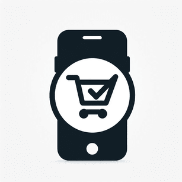

# REstock 🛒

REstock is a Flutter mobile application designed to help users create and manage shopping lists for household items. Whether you're planning a trip to the grocery store or organizing your pantry, REstock makes it easy to keep track of what you need to buy.

## Demo 🎥


## Features ✨

- **Create Shopping List items:** Easily create new shopping list items to them.
- **Manage Items:** Edit & delete shopping list items,
- **Categories:** Organize your items by categories such as vegetables, dairy, carbs, meat etc.
- **Sync Across Devices:** Sign in with your account to sync your shopping list items across multiple devices.

## Tech Stack 🔨

**Client:** [Flutter](https://flutter.dev/) & [Dart](https://dart.dev/)

**BaaS:** [Firebase](https://firebase.google.com/)

## Getting Started & Run Locally 🚀

To get started with REstock, follow these steps:

Clone the project

```bash
  git clone https://github.com/vamuigua/restock/
```

Go to the project directory

```bash
  cd restock
```

Install dependencies

```bash
  flutter pub get
```

Run the App on a connected device or simulator/emulator

```bash
  flutter run
```

**Start using REstock:** Once the app is running, you can start creating your shopping list and add items.

## Lessons Learned 📚

While building REstock, I gained valuable experience and encountered various challenges. Here are some of the key lessons learned:

- **Using Firebase as a BaaS:** Integrating Firebase Realitime Database as a Backend as a Service (BaaS) allowed for seamless data storage and synchronization across devices. To further secure user data, I plan to use Firebase authentication and configure the necessary read & write rules.

- **HTTP Requests with Flutter:** Leveraging the [http](https://pub.dev/packages/http) Flutter package, I learned how to send HTTP requests to interact with Firebase Realtime Database. This included handling different HTTP methods (GET, POST, PUT, DELETE) for CRUD operations on the shopping list items.

## Roadmap & Improvements 🛠️

- [x] UI: Move "Add item" icon to bottom navigation bar for easier reach
- [x] feat: Quickly find items using search functionality
- [ ] feat: Ability to pull-down to refresh data
- [ ] feat: Filtering by category
- [ ] feat: Ability to sync local storage & online data
- [ ] feat: Create multiple shopping lists
- [ ] feat: Mark items as purchased to keep your lists up-to-date
- [ ] feat: Set reminders for important items or lists
- [ ] feat: Ability to create custom categories

## Acknowledgements 🙏

REstock was created with the help of the following resources:

- [Flutter & Dart - The Complete Guide [2024 Edition]](https://www.udemy.com/course/learn-flutter-dart-to-build-ios-android-apps/) - This course served as the foundation for my journey in developing the REstock app. While the initial concept and some features were part of the course projects, I've invested significant effort into refining, enhancing, and adding unique features to give REstock its distinct personality and functionality. Through countless iterations, improvements, and updates, I've tailored the app to meet the specific needs of users, infusing it with a personal touch and ensuring a delightful user experience 😊

## Feedback 📣

If you have any feedback, please reach out at vamuigua@gmail.com
